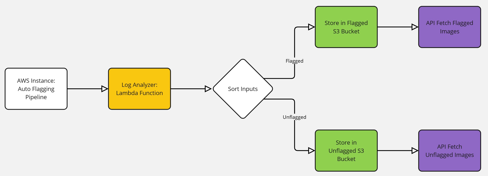

# S3 Image Management Lambda Functions
  

This repository contains AWS Lambda functions for managing and retrieving images stored in an S3 bucket. The system is designed to handle both flagged and unflagged images, with support for batch operations and annotated frames.

## Overview

The system consists of three main Lambda functions:

1. **Batch Fetcher** (`fetch_batches.py`)
   - Lists available batches within a specified folder
   - Handles CORS for cross-origin requests
   - Returns subfolder names for further processing

2. **Flagged Image Retriever** (`fetch_flagged_annotated_images.py`)
   - Retrieves annotated frames from the flagged images directory
   - Generates presigned URLs for secure access
   - Returns URLs with one-hour validity

3. **Unflagged Frame Retriever** (`fetch_unflagged_frame_from_batch.py`)
   - Fetches annotated frames from specific device batches
   - Requires device name and batch number parameters
   - Returns presigned URLs for the requested frames

## Prerequisites

- AWS Account with appropriate permissions
- Python 3.x
- boto3 library
- Configured S3 bucket named 'logs-flipkart'

## Installation

1. Set up an AWS Lambda function for each Python file
2. Configure the IAM roles with necessary S3 permissions
3. Set up API Gateway triggers if needed
4. Ensure CORS is properly configured if accessing from web applications

## Usage

### Fetch Batches

```python
# Example request body
{
    "folder_name": "device_name"
}
```

### Fetch Flagged Annotated Images

No request body needed - returns all flagged annotated images.

### Fetch Unflagged Frames from Batch

```python
# Example request body
{
    "device_name": "device_1",
    "batch_number": "batch_001"
}
```

## Directory Structure

```
S3 Bucket (logs-flipkart)
├── flagged/
│   └── annotated_frames/
└── unflagged/
    └── device_name/
        └── batch_number/
            └── annotated_frames/
```

## Error Handling

All functions include comprehensive error handling and return appropriate HTTP status codes:
- 200: Successful operation
- 400: Invalid request parameters
- 404: Resources not found
- 500: Server error

## CORS Support

All endpoints support CORS with the following headers:
- Access-Control-Allow-Origin: *
- Access-Control-Allow-Methods: *
- Access-Control-Allow-Headers: *

## Security

- All image access is provided through presigned URLs
- URLs expire after 1 hour for security
- Proper error handling to prevent information leakage
